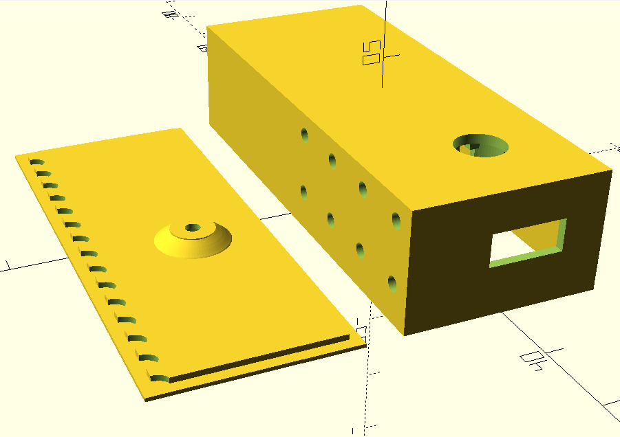
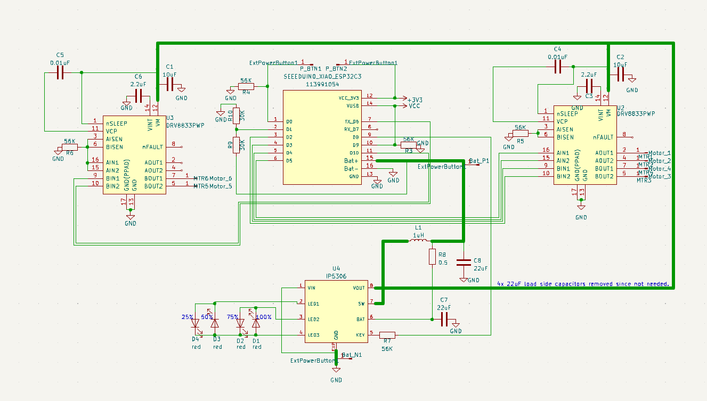
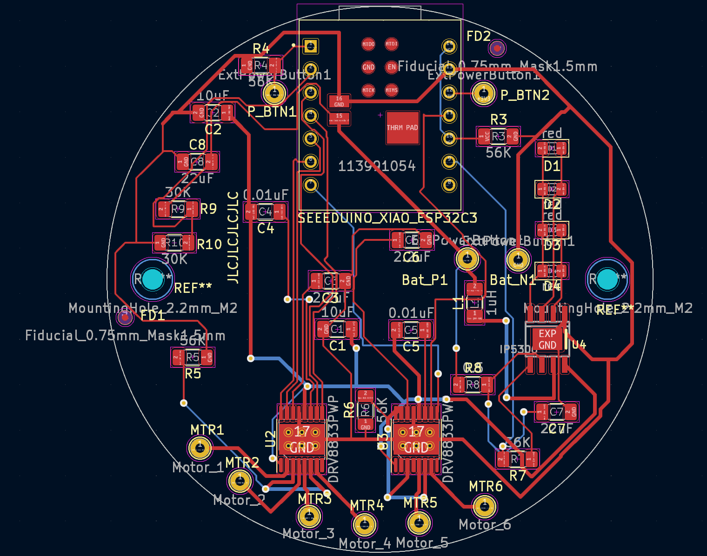

# Penta Buzzer
A buzz for the fingers.  
Open source code and assembly for a mobile 4 buzzer hand thingy.  
Purpose of this device is to provide a pre-programmed buzzing pattern to each of the 4 fingers.  
## 💡 Current Features
* Runs program to buzz each finger at set intervals.
* Battery life of over 4hrs while running.
* On/Off button.
* Charge port that also doubles as programming port.
## ⚠️ Word of Warning
* This project is at its infancy. The current hardware design will change and may not work with future versions of this code.
* Project requires intermediate skills in soldering. There are a few surface mount soldering points and many close solder pads. Practice technique if you are unsure.
* ESP32 does not have reverse polarity protection (ask me how I know). Check your work before you fry your board.
* This is not a well designed product (yet). Parts will and have failed. 
### BOM
* [Seeed Studio XIAO ESP32-C3][esp32_c3_link]. This is the microcontroller used in this project. This was chosen due to its built in connectivity and battery management circuitry.  
* [DRV 8833][drv_8833_link]. This is the motor controller which will power each of the 4 buzzers.  
* [MakerFocus 2A 5V Charging Protection Module][makerfocus_charge_discharge_module_link]. This is used to provide 5v for the motors and show current battery capacity. The charging of the battery is accomplished by the microcontroller circuit.
* [9 by 20 by 30mm lithium ion battery][lithium_ion_battery_link] 
* Heat Shrink
* 30AWG stranded wire.
* 22AWG solid core wire.
### 3d Printable Case

There is an OpenScad document in the Models directory that can be 3d printed as an enclosure for the whole setup. I plan to rework this as it was a pain to assemble.
## 🛠 Flash Firmware (For Users)

## 🛠 Installation Setup (For Developers)
### Install Arduino IDE
### Install Board Support Packages for ESP32
### Install Visual Studio Code (VS-Code)

### Install Platform IO Extension for VS-Code

### Flash Board Firmware

## 🔬 Future plans
### Version 2
* Goal of Version 2 is to see if I can create a PCB that works, is small, and combines many boards into a small footprint.
* Explore fabrication proccess
* Additional goal is for me (wolffinator) to get better at SMD soldering since this will most likely require some rework/repair.
### Version 2 Progress:
#### Schematic

#### PCB Layout

### Version 3
* Goal of Version 3 is to make the design as easy to produce as possible.
* I would love to provide a link for users here to click on and get a quote from one or (or many) PCB manufacturers and have them solder all of the components. It looks like Version 2 requires some hand soldering of SMD components afterwards, which can be difficult.
* Provide a link to a 3d printed case.
* Simplify case assembly and wire soldering as much as possible.
* Include more detailed assembly instructions.

[drv_8833_link]: https://www.amazon.com/gp/product/B0BGLH27GG/ref=sw_img_1?smid=A2QD586WPO9XSR&psc=1
[esp32_c3_link]: https://www.digikey.com/en/products/detail/seeed-technology-co-ltd/113991054/16652880?s=N4IgTCBcDaIM4FMkBMAEcAuBXZBLA9qgBoCSAggPKoCiAygAoDMYAwoyALoC%2BQA
[makerfocus_charge_discharge_module_link]: https://www.amazon.com/gp/product/B07PZT3ZW2/ref=ppx_yo_dt_b_search_asin_image?ie=UTF8&psc=1
[lithium_ion_battery_link]: https://www.aliexpress.us/item/3256804370986754.html?spm=a2g0o.order_list.order_list_main.4.64bc18023Wexc3&gatewayAdapt=glo2usa
